# Diagrams Reference

Complete syntax reference for Mermaid, PlantUML, and D2.

---

## Mermaid

### Best Practices for Presentations (Advanced Slides / reveal.js)

**Problem:** Mermaid generates SVG with dynamic viewBox, causing unpredictable sizing.

**Solution:** Use `useMaxWidth: false` + standardized spacing + CSS-only sizing (no JavaScript).

#### Standard Configuration Template

```
%%{init: {"theme": "base", "themeVariables": {"primaryColor": "#2E5A88", "primaryTextColor": "#F5F5F5", "primaryBorderColor": "#2E8BC0", "lineColor": "#2E8BC0", "secondaryColor": "#1A3A5C", "tertiaryColor": "#2E8BC0", "fontSize": "18px"}, "flowchart": {"useMaxWidth": false, "htmlLabels": true, "nodeSpacing": 50, "rankSpacing": 80, "padding": 15, "diagramPadding": 8, "curve": "basis"}}}%%
```

#### Key Parameters

| Parameter | Value | Why |
|-----------|-------|-----|
| `useMaxWidth` | **false** | Prevents auto-resize, stable dimensions |
| `nodeSpacing` | 50 | Consistent horizontal spacing |
| `rankSpacing` | 80 | Consistent vertical spacing |
| `fontSize` | 18px | Readable on presentation screens |
| `padding` | 15 | Internal node padding |

#### CSS for Presentations (No JavaScript!)

```css
/* Mermaid Container */
.mermaid {
  display: flex !important;
  justify-content: center !important;
  align-items: center !important;
  width: 100% !important;
  min-height: 150px;
}

/* SVG - No transform:scale()! Let Mermaid control size */
.mermaid svg {
  max-width: 100% !important;
  max-height: 100% !important;
  height: auto !important;
  width: auto !important;
}
```

**Why no JavaScript?**
- `setInterval`/`setTimeout` cause race conditions with reveal.js rendering
- CSS is deterministic and applies immediately
- `useMaxWidth: false` gives Mermaid full size control

---

### Diagram Types

| Type | Keyword | Use Case |
|------|---------|----------|
| Flowchart | `flowchart` | Process flows, decisions |
| Sequence | `sequenceDiagram` | Interactions over time |
| Class | `classDiagram` | OOP structures |
| State | `stateDiagram-v2` | State machines |
| ERD | `erDiagram` | Database schemas |
| Gantt | `gantt` | Project timelines |
| Pie | `pie` | Proportional data |
| Mindmap | `mindmap` | Hierarchical brainstorming |
| Timeline | `timeline` | Chronological events |
| Quadrant | `quadrantChart` | 2-axis positioning |
| Git | `gitGraph` | Branch visualization |
| C4 | `C4Context` | Architecture diagrams |

### Flowchart

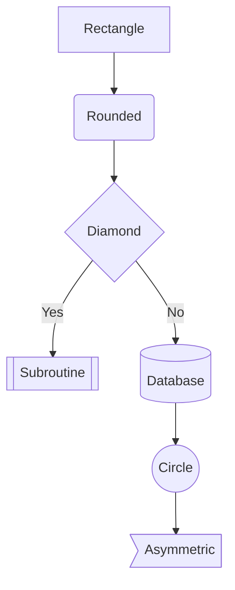

**Direction:** `TB` (top-bottom), `TD`, `BT`, `LR`, `RL`

**Node Shapes:**
- `[text]` - Rectangle
- `(text)` - Rounded
- `([text])` - Stadium
- `[[text]]` - Subroutine
- `[(text)]` - Cylinder/Database
- `((text))` - Circle
- `{text}` - Diamond
- `{{text}}` - Hexagon
- `>text]` - Asymmetric

**Links:**
```
A --> B        Arrow
A --- B        Open link
A -.-> B       Dotted arrow
A ==> B        Thick arrow
A <--> B       Bidirectional
A -->|text| B  Labeled
```

**Subgraphs:**
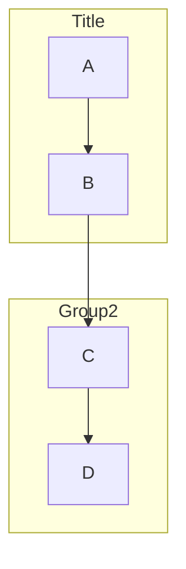

**Styling:**
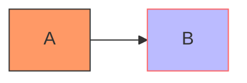

### Sequence Diagram

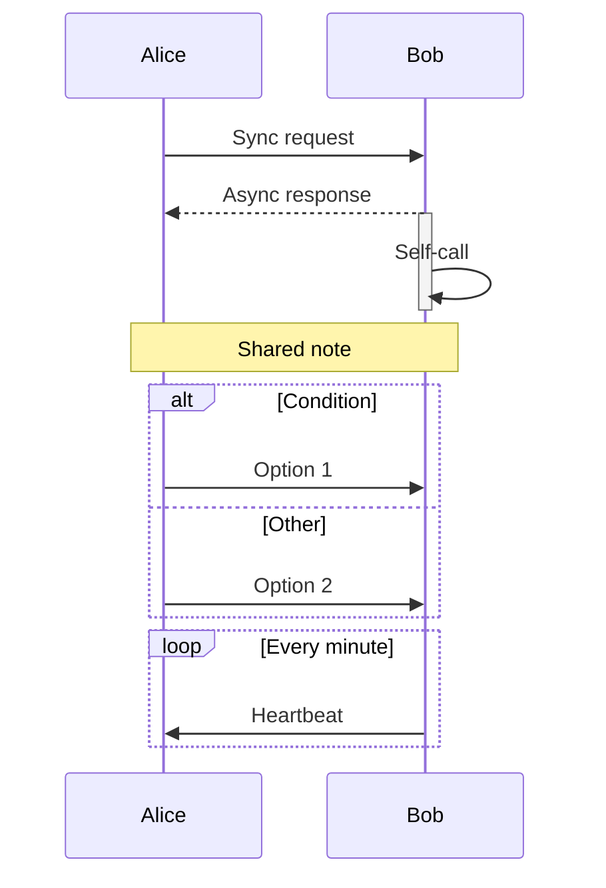

**Arrow Types:**
- `->` solid, no arrow
- `-->` dotted, no arrow
- `->>` solid with arrowhead
- `-->>` dotted with arrowhead
- `-x` solid with cross
- `-)` async (open arrow)

**Blocks:** `alt/else`, `opt`, `loop`, `par`, `critical`, `break`

### Class Diagram

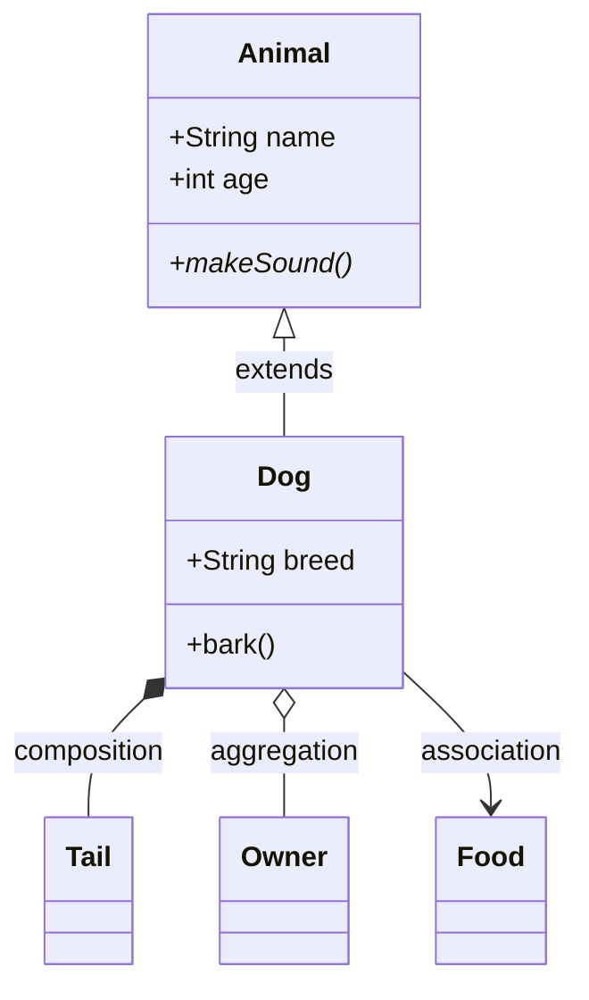

**Visibility:** `+` public, `-` private, `#` protected, `~` package

**Relationships:**
- `<|--` Inheritance
- `*--` Composition
- `o--` Aggregation
- `-->` Association
- `..>` Dependency
- `<|..` Realization

### State Diagram

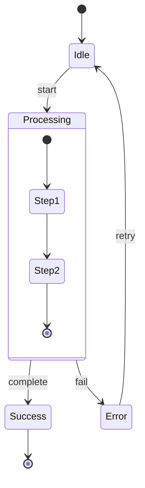

### ERD (Entity Relationship)

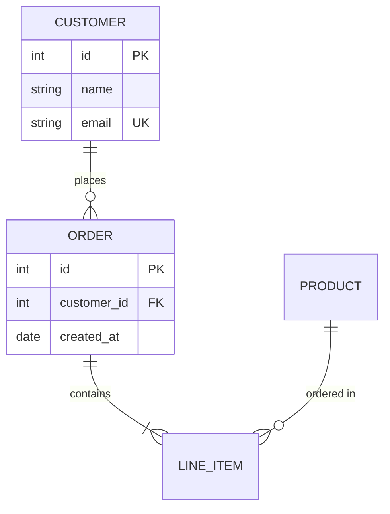

**Cardinality:**
- `||` exactly one
- `|o` zero or one
- `}|` one or more
- `}o` zero or more

### Gantt Chart

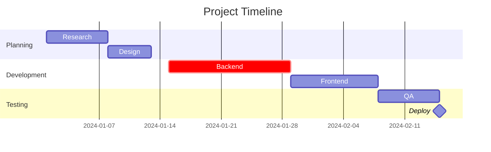

**Tags:** `crit` (critical), `done`, `active`, `milestone`

### Pie Chart

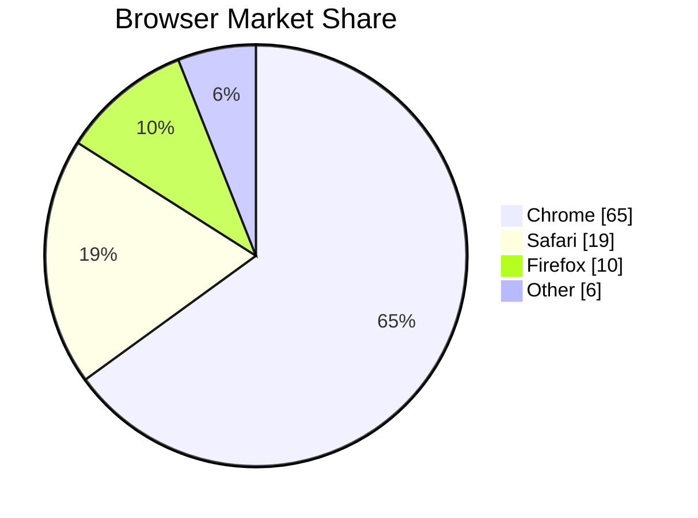

### Mindmap

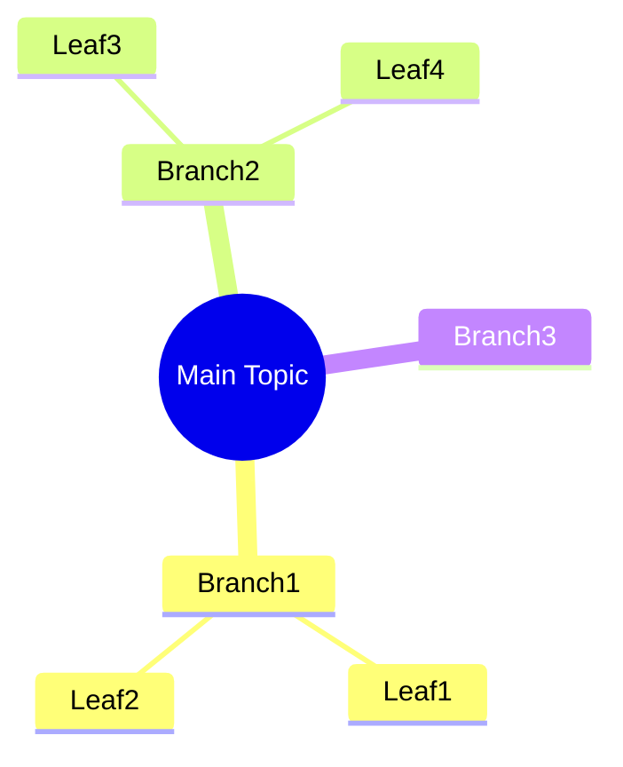

### C4 Diagram

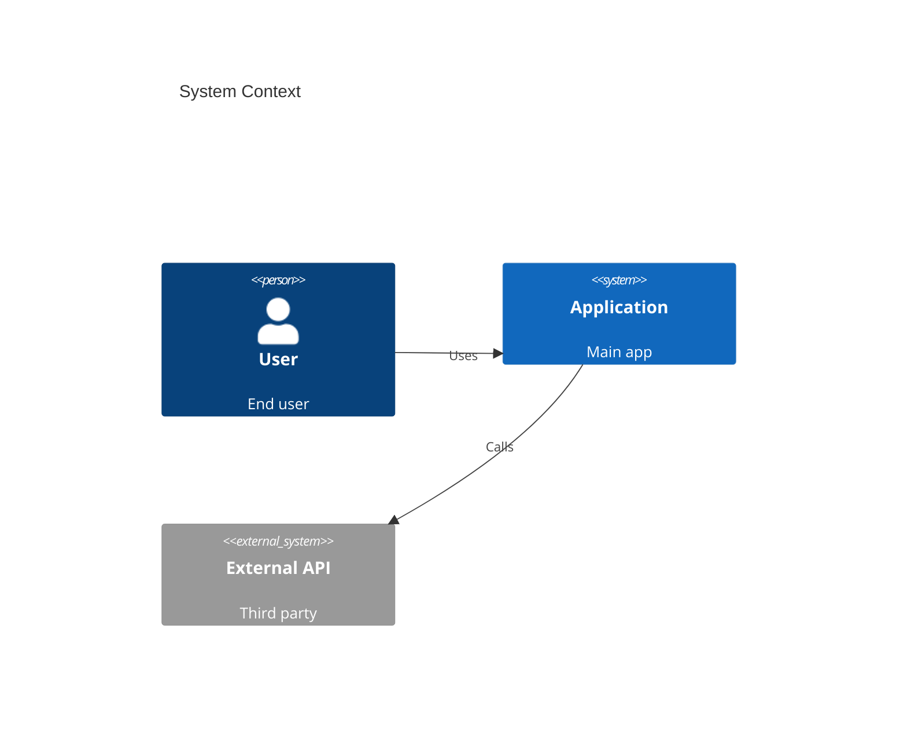

---

## PlantUML

### Basic Structure

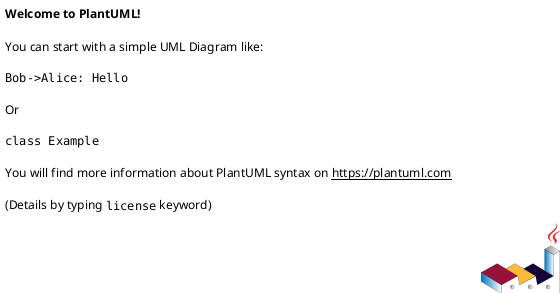

### Sequence Diagram

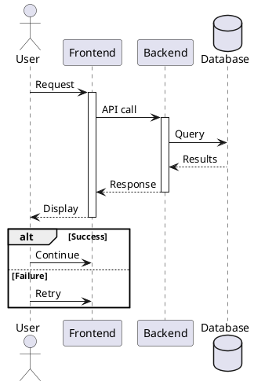

**Participant Types:** `actor`, `participant`, `boundary`, `control`, `entity`, `database`, `collections`, `queue`

**Arrows:**
- `->` solid
- `-->` dotted
- `->>` thin
- `->x` lost message
- `->o` circle end

### Class Diagram

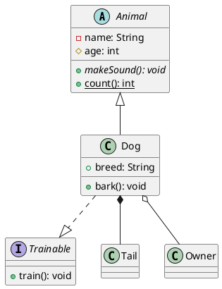

**Visibility:** `+` public, `-` private, `#` protected, `~` package

**Modifiers:** `{abstract}`, `{static}`

### Activity Diagram

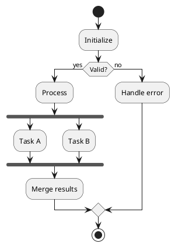

### State Diagram

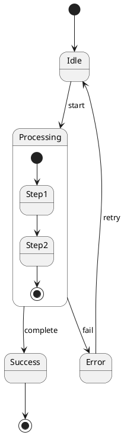

### Component Diagram

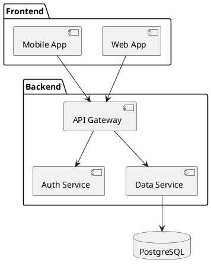

### Use Case Diagram

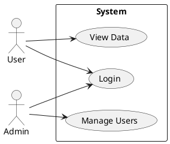

### Deployment Diagram

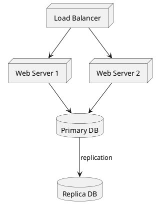

### Theming

```plantuml
@startuml
!theme cerulean
' Available: amiga, aws-orange, black-knight, blueprint, cerulean,
' crt-amber, crt-green, mars, materia, metal, plain, sketchy, toy, vibrant
@enduml
```

### Skinparam (Custom Styling)

```plantuml
@startuml
skinparam backgroundColor #EEEEEE
skinparam roundcorner 15
skinparam sequence {
    ArrowColor #333333
    ActorBorderColor #333333
    LifeLineBorderColor #333333
    ParticipantBackgroundColor #FFFFFF
}
@enduml
```

---

## D2

### Basic Syntax

```d2
# Shapes
rectangle: Rectangle
oval: {
    shape: oval
}
cylinder: {
    shape: cylinder
    label: Database
}

# Connections
rectangle -> oval: arrow
oval -- cylinder: line
```

### Connection Types

```d2
a -> b: directional
b <- c: reverse
d <-> e: bidirectional
f -- g: undirected
```

**Arrowheads:** `triangle`, `arrow`, `diamond`, `circle`, `cf-one`, `cf-many`

### Shapes

```d2
rect: Rectangle
square: {shape: square}
circle: {shape: circle}
oval: {shape: oval}
diamond: {shape: diamond}
hexagon: {shape: hexagon}
cylinder: {shape: cylinder}
queue: {shape: queue}
package: {shape: package}
page: {shape: page}
parallelogram: {shape: parallelogram}
person: {shape: person}
cloud: {shape: cloud}
```

### Containers (Nesting)

```d2
frontend: {
    web: Web App
    mobile: Mobile App
}

backend: {
    api: API Gateway
    auth: Auth Service
    data: Data Service
}

frontend.web -> backend.api
frontend.mobile -> backend.api
backend.api -> backend.auth
backend.api -> backend.data
```

### SQL Tables

```d2
users: {
    shape: sql_table
    id: int {constraint: primary_key}
    email: varchar(255) {constraint: unique}
    name: varchar(100)
    created_at: timestamp
}

orders: {
    shape: sql_table
    id: int {constraint: primary_key}
    user_id: int {constraint: foreign_key}
    total: decimal
    status: varchar(20)
}

users.id <-> orders.user_id
```

### Icons

```d2
server: {
    icon: https://icons.terrastruct.com/essentials/server.svg
}

database: {
    icon: https://icons.terrastruct.com/essentials/database.svg
    shape: cylinder
}

cloud: {
    icon: https://icons.terrastruct.com/aws/Compute/Amazon-EC2.svg
}
```

### Styling

```d2
a: {
    style: {
        fill: "#f0f0f0"
        stroke: "#333333"
        stroke-width: 2
        border-radius: 8
        font-color: "#000000"
        shadow: true
    }
}

# Global styles
*.style.fill: "#ffffff"
```

### Classes (Reusable Styles)

```d2
classes: {
    primary: {
        style: {
            fill: "#4A90D9"
            font-color: "#ffffff"
        }
    }
    secondary: {
        style: {
            fill: "#E8E8E8"
        }
    }
}

header.class: primary
sidebar.class: secondary
```

### Layers and Scenarios

```d2
# Base layer
api: API Server
db: Database
api -> db

# Scenario: with cache
scenarios: {
    with-cache: {
        cache: Redis Cache {
            shape: cylinder
        }
        api -> cache
        cache -> db
    }
}
```

### Direction

```d2
direction: right  # left, right, up, down
```

### Themes

Available via CLI: `--theme N` where N is theme ID (0-300+)

Popular themes:
- 0: Default
- 1: Neutral grey
- 3: Grape/purple
- 4: Cool classics (blue)
- 100: Dark themes start
- 200: Terminal theme
