# Patterns & Templates

Ready-to-use templates for common diagram and animation patterns.

---

## Software Architecture

### API Gateway Pattern (Mermaid)

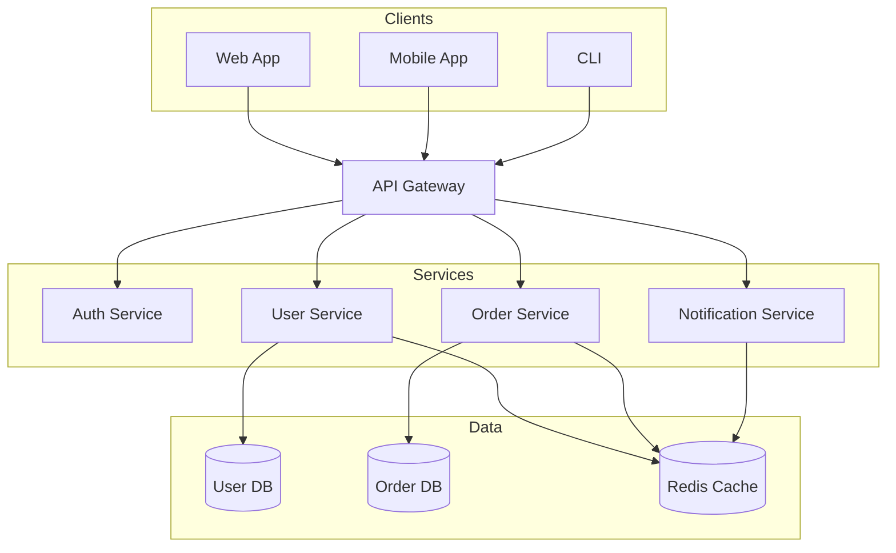

### Microservices Topology (D2)

```d2
direction: right

clients: {
    web: Web App
    mobile: Mobile App
}

gateway: API Gateway {
    style.fill: "#4A90D9"
}

services: {
    auth: Auth {
        icon: https://icons.terrastruct.com/essentials/lock.svg
    }
    users: Users
    orders: Orders
    payments: Payments
    notifications: Notifications
}

data: {
    postgres: PostgreSQL {
        shape: cylinder
    }
    redis: Redis {
        shape: cylinder
    }
    kafka: Kafka {
        shape: queue
    }
}

clients.web -> gateway
clients.mobile -> gateway

gateway -> services.auth
gateway -> services.users
gateway -> services.orders

services.users -> data.postgres
services.orders -> data.postgres
services.orders -> data.kafka
services.payments -> data.kafka
services.notifications <- data.kafka
services.* -> data.redis: cache
```

### C4 Context Diagram (Mermaid)

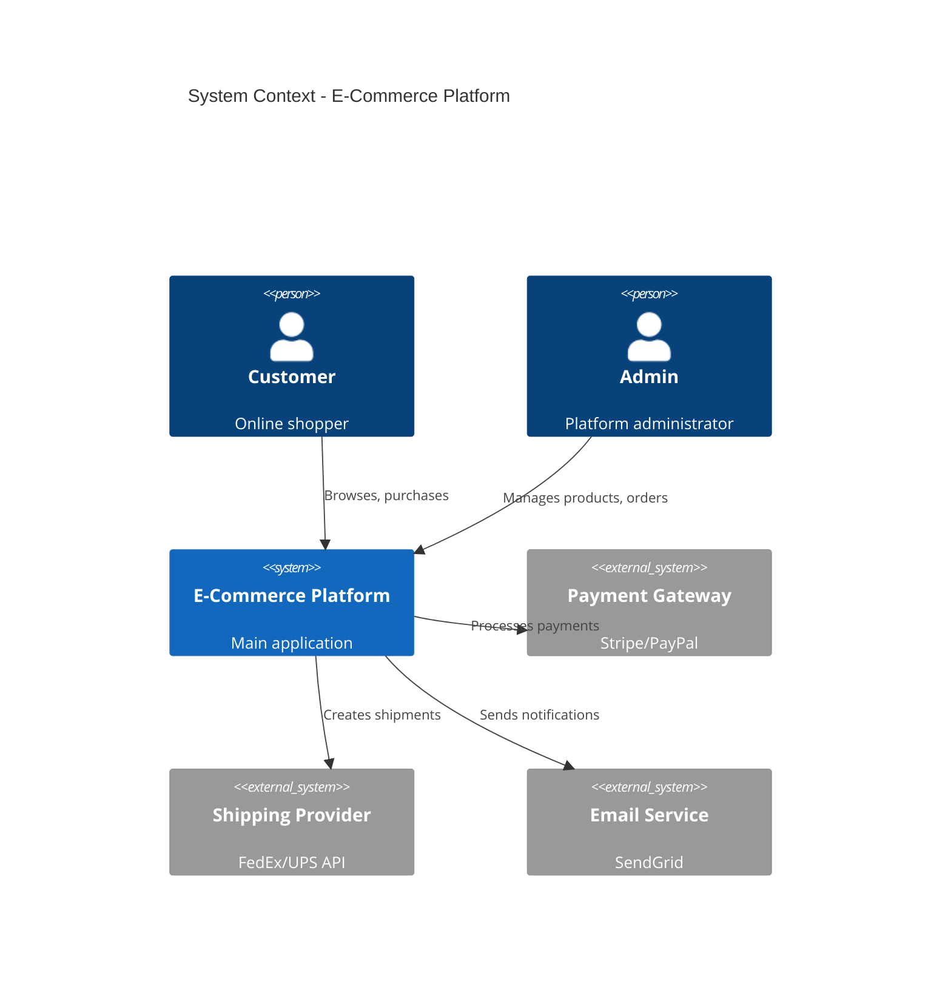

### Event-Driven Architecture (PlantUML)

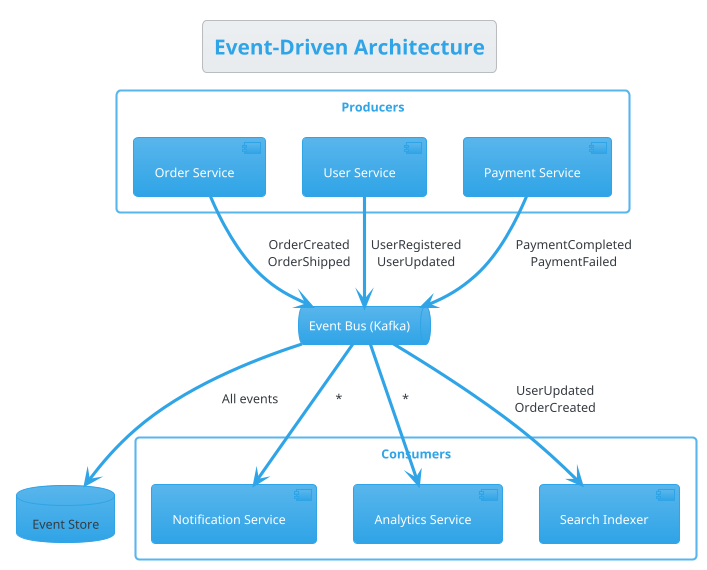

---

## Data & Database

### Relational ERD (Mermaid)

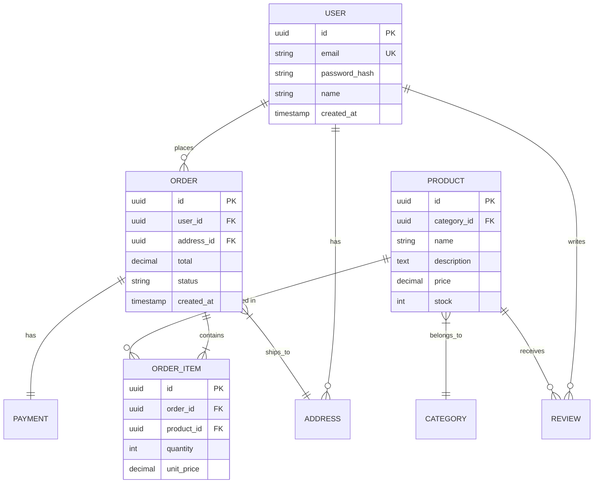

### SQL Tables (D2)

```d2
users: {
    shape: sql_table
    id: uuid {constraint: primary_key}
    email: varchar(255) {constraint: unique}
    name: varchar(100)
    created_at: timestamp
}

orders: {
    shape: sql_table
    id: uuid {constraint: primary_key}
    user_id: uuid {constraint: foreign_key}
    total: decimal(10,2)
    status: varchar(20)
    created_at: timestamp
}

products: {
    shape: sql_table
    id: uuid {constraint: primary_key}
    name: varchar(200)
    price: decimal(10,2)
    stock: int
}

order_items: {
    shape: sql_table
    id: uuid {constraint: primary_key}
    order_id: uuid {constraint: foreign_key}
    product_id: uuid {constraint: foreign_key}
    quantity: int
    unit_price: decimal(10,2)
}

users.id <-> orders.user_id
orders.id <-> order_items.order_id
products.id <-> order_items.product_id
```

### Data Pipeline Flow (Mermaid)

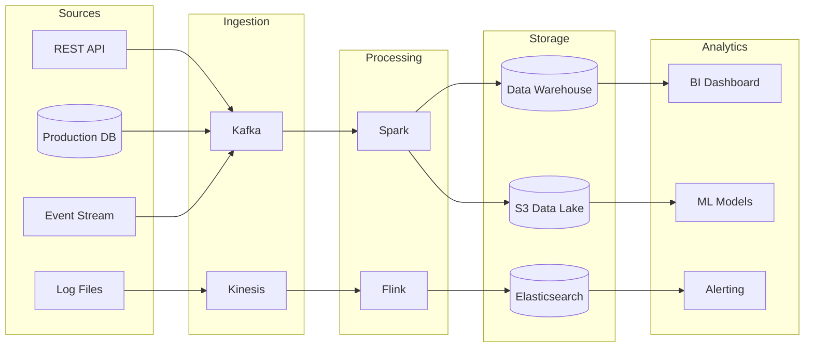

---

## Process & Workflow

### Git Branching Strategy (Mermaid)

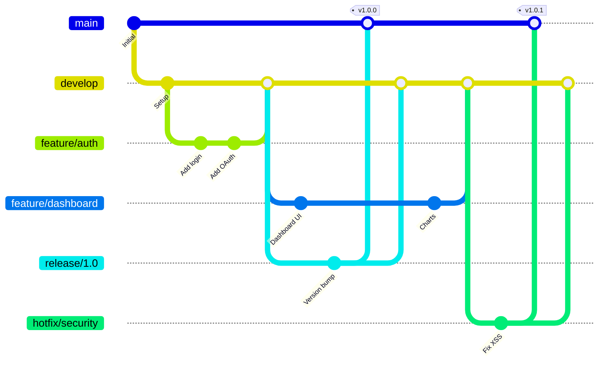

### CI/CD Pipeline (Mermaid)

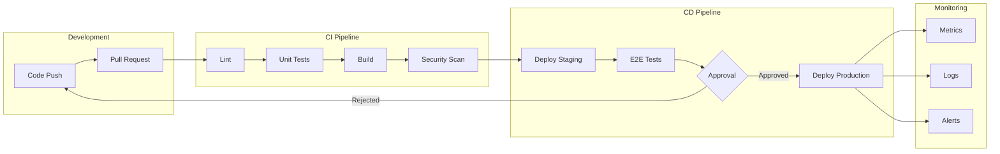

### State Machine (Mermaid)

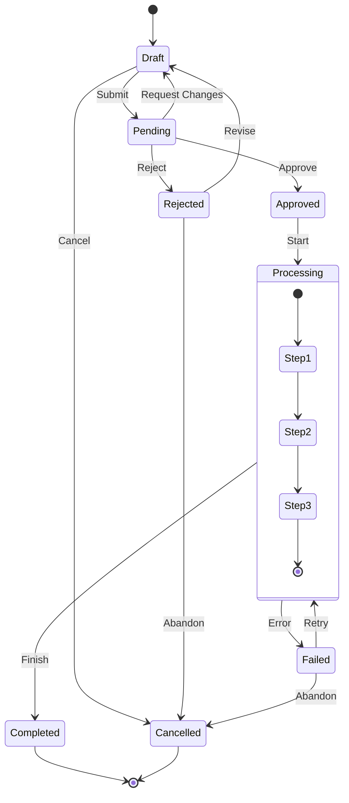

### Decision Flowchart (Mermaid)

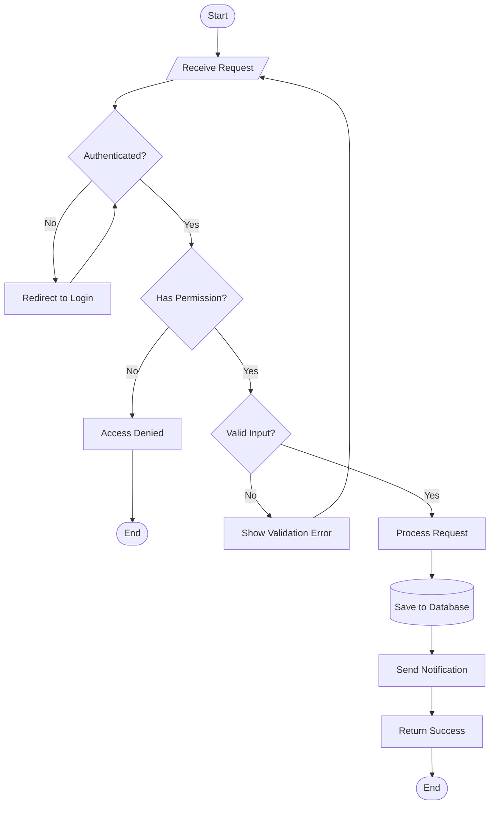

### User Journey (Mermaid)

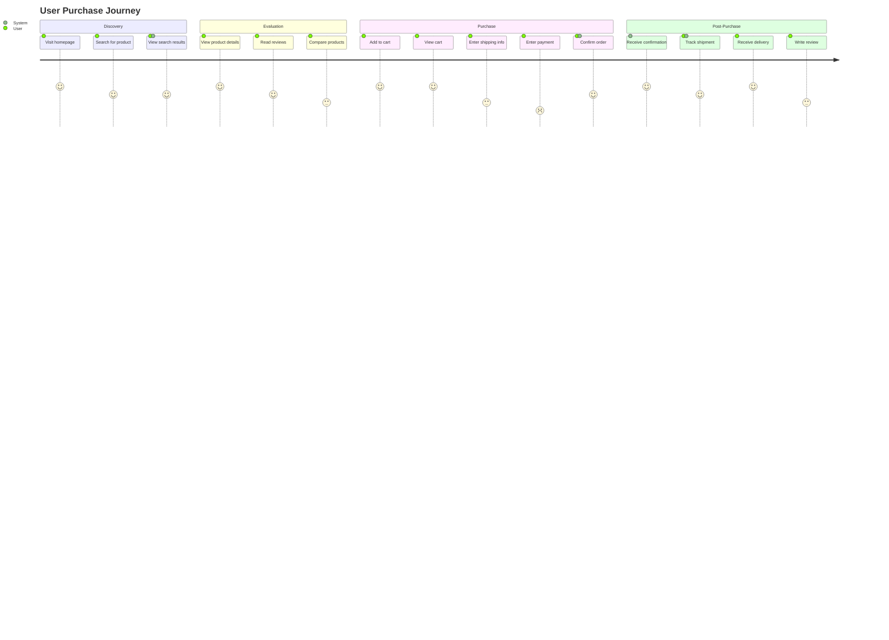

### Gantt Project Timeline (Mermaid)

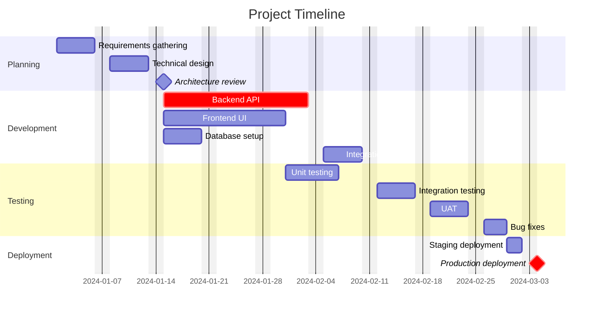

---

## Animation Patterns

### Animated Flowchart (Manim)

```python
from manim import *

class AnimatedFlowchart(Scene):
    def construct(self):
        # Create nodes
        start = Circle(radius=0.3, color=GREEN).shift(UP*2)
        start_text = Text("Start", font_size=20).move_to(start)

        process1 = Rectangle(width=2, height=0.8, color=BLUE)
        process1_text = Text("Process A", font_size=18).move_to(process1)

        decision = Polygon(
            UP*0.5, RIGHT*0.8, DOWN*0.5, LEFT*0.8,
            color=YELLOW
        ).shift(DOWN*1.5)
        decision_text = Text("?", font_size=24).move_to(decision)

        end = Circle(radius=0.3, color=RED).shift(DOWN*3)
        end_text = Text("End", font_size=20).move_to(end)

        # Create arrows
        arrow1 = Arrow(start.get_bottom(), process1.get_top(), buff=0.1)
        arrow2 = Arrow(process1.get_bottom(), decision.get_top(), buff=0.1)
        arrow3 = Arrow(decision.get_bottom(), end.get_top(), buff=0.1)

        # Animate
        self.play(Create(start), Write(start_text))
        self.play(GrowArrow(arrow1))
        self.play(Create(process1), Write(process1_text))
        self.play(GrowArrow(arrow2))
        self.play(Create(decision), Write(decision_text))
        self.play(GrowArrow(arrow3))
        self.play(Create(end), Write(end_text))
        self.wait()
```

### Data Visualization (Manim)

```python
from manim import *

class BarChartAnimation(Scene):
    def construct(self):
        chart = BarChart(
            values=[3, 5, 2, 8, 4],
            bar_names=["A", "B", "C", "D", "E"],
            y_range=[0, 10, 2],
            y_length=5,
            x_length=8,
            bar_colors=[BLUE, GREEN, RED, YELLOW, PURPLE]
        )

        self.play(Create(chart), run_time=2)
        self.wait()

        # Animate value change
        self.play(
            chart.animate.change_bar_values([5, 3, 7, 4, 6]),
            run_time=1.5
        )
        self.wait()
```

### Particle System (p5.js)

```javascript
let particles = [];

function setup() {
    createCanvas(800, 600);
}

function draw() {
    background(20, 20, 30);

    // Add new particles at mouse
    if (mouseIsPressed) {
        for (let i = 0; i < 3; i++) {
            particles.push(new Particle(mouseX, mouseY));
        }
    }

    // Update and draw particles
    for (let i = particles.length - 1; i >= 0; i--) {
        particles[i].update();
        particles[i].draw();

        if (particles[i].isDead()) {
            particles.splice(i, 1);
        }
    }
}

class Particle {
    constructor(x, y) {
        this.pos = createVector(x, y);
        this.vel = createVector(random(-2, 2), random(-5, -2));
        this.acc = createVector(0, 0.1);
        this.lifespan = 255;
        this.size = random(5, 15);
        this.color = color(random(100, 255), random(50, 150), random(200, 255));
    }

    update() {
        this.vel.add(this.acc);
        this.pos.add(this.vel);
        this.lifespan -= 3;
    }

    draw() {
        noStroke();
        this.color.setAlpha(this.lifespan);
        fill(this.color);
        circle(this.pos.x, this.pos.y, this.size);
    }

    isDead() {
        return this.lifespan <= 0;
    }
}
```

### Animated Bar Chart (D3.js)

```javascript
const data = [
    { name: 'A', value: 30 },
    { name: 'B', value: 50 },
    { name: 'C', value: 20 },
    { name: 'D', value: 80 },
    { name: 'E', value: 45 }
];

const width = 600, height = 400;
const margin = { top: 20, right: 20, bottom: 30, left: 40 };

const x = d3.scaleBand()
    .domain(data.map(d => d.name))
    .range([margin.left, width - margin.right])
    .padding(0.2);

const y = d3.scaleLinear()
    .domain([0, d3.max(data, d => d.value)])
    .range([height - margin.bottom, margin.top]);

const svg = d3.select('body').append('svg')
    .attr('width', width)
    .attr('height', height);

// Animated bars
svg.selectAll('rect')
    .data(data)
    .join('rect')
    .attr('x', d => x(d.name))
    .attr('width', x.bandwidth())
    .attr('y', height - margin.bottom)
    .attr('height', 0)
    .attr('fill', 'steelblue')
    .transition()
    .duration(800)
    .delay((d, i) => i * 100)
    .attr('y', d => y(d.value))
    .attr('height', d => y(0) - y(d.value));

// Axes
svg.append('g')
    .attr('transform', `translate(0,${height - margin.bottom})`)
    .call(d3.axisBottom(x));

svg.append('g')
    .attr('transform', `translate(${margin.left},0)`)
    .call(d3.axisLeft(y));
```
