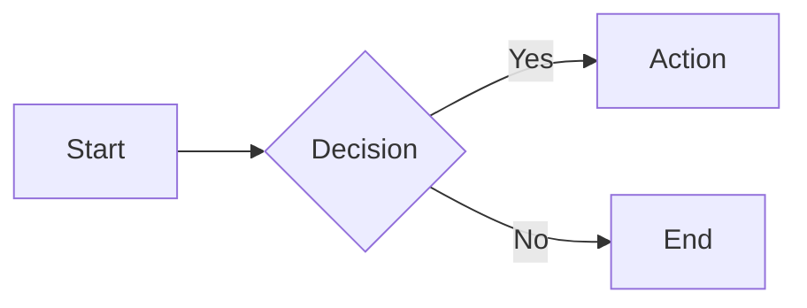
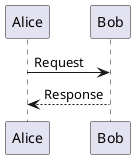

# Visual Assets Skill

Expert skill for creating diagrams, schemas, and animations with export capabilities.

## Quick Reference

| Tool | Best For | Output |
|------|----------|--------|
| **Mermaid** | Quick flowcharts, sequences, ERD, Gantt | PNG, SVG, PDF |
| **PlantUML** | Formal UML, detailed sequences, activity | PNG, SVG, PDF |
| **D2** | Architecture, SQL tables, layers | PNG, SVG, PDF |
| **Manim** | Math/educational animations | MP4, GIF, PNG |
| **p5.js** | Creative coding, generative art | PNG, GIF, MP4 |
| **D3.js** | Data visualizations, charts | SVG, PNG |

## Tool Selection Decision Tree

```
Is it animated?
├── YES → What kind?
│   ├── Math/Educational → Manim
│   ├── Generative Art → p5.js
│   └── Data Transitions → D3.js
│
└── NO → What type?
    ├── Flowchart → Mermaid
    ├── Sequence Diagram → Mermaid (quick) or PlantUML (detailed)
    ├── Architecture/System → D2
    ├── Database/ERD → Mermaid or D2 (SQL tables)
    ├── UML (Class/State/Activity) → PlantUML
    ├── Project Timeline → Mermaid Gantt
    ├── Mindmap → Mermaid or PlantUML
    └── Data Chart → D3.js (static SVG)
```

## Output Directory

All assets saved to:
```
~/Library/Mobile Documents/iCloud~md~obsidian/Documents/my_vault/Resources/
└── {asset-name}-{YYYYMMDD-HHMMSS}/
    ├── source.{mmd|puml|d2|py|js}
    ├── {asset-name}.png
    ├── {asset-name}.svg
    └── {asset-name}.mp4  # If animated
```

## Reference Files

| File | Use When |
|------|----------|
| [DIAGRAMS.md](DIAGRAMS.md) | Creating Mermaid, PlantUML, or D2 diagrams |
| [ANIMATIONS.md](ANIMATIONS.md) | Creating Manim, p5.js, or D3.js animations |
| [EXPORT.md](EXPORT.md) | Rendering and exporting to various formats |
| [PATTERNS.md](PATTERNS.md) | Looking for templates and common patterns |

## Quick Examples

### Mermaid Flowchart


### PlantUML Sequence


### D2 Architecture
```d2
client -> api: REST
api -> db: SQL
db: {
    shape: cylinder
}
```

### Manim Animation
```python
from manim import *

class Example(Scene):
    def construct(self):
        circle = Circle()
        self.play(Create(circle))
```

## Workflow

<workflow>
1. **Analyze Request**
   - Determine if static or animated
   - Identify diagram type
   - Select optimal tool

2. **Generate Code**
   - Create source in appropriate syntax
   - Apply styling/theming

3. **Export**
   - Create output folder with timestamp
   - Save source file
   - Render to requested formats (PNG, SVG, GIF, MP4)

4. **Iterate**
   - Review output
   - Refine based on feedback
</workflow>

## Installation Requirements

<requirements>
### Diagram Tools
```bash
# Mermaid CLI
npm install -g @mermaid-js/mermaid-cli

# PlantUML (requires Java)
brew install plantuml

# D2
curl -fsSL https://d2lang.com/install.sh | sh -s --
```

### Animation Tools
```bash
# Manim
pip install manim

# p5.js headless rendering
npm install -g puppeteer

# D3.js server-side
npm install -g d3 jsdom
```
</requirements>
