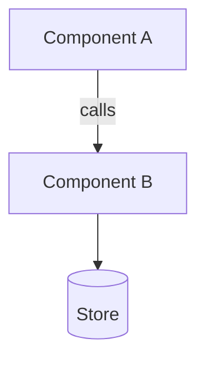
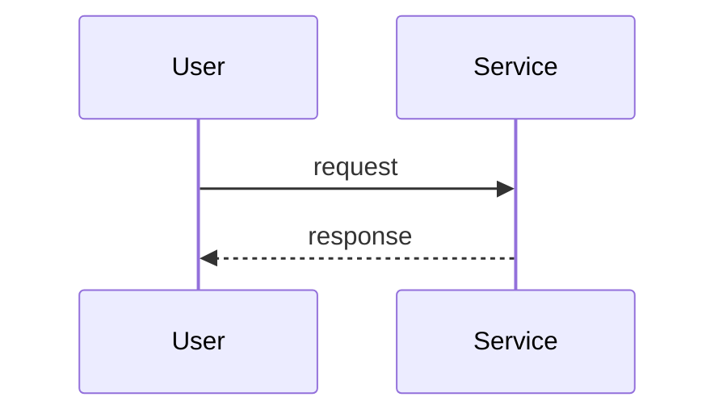

## Context

<!-- Current state and constraints that shape the approach. See proposal.md for motivation - don't restate it -->

## Architecture

<!-- The shape of the solution: components and how they relate, or the data model.
     Replace the diagram below - do not ship the placeholder.
     Pick the form that fits: flowchart (components/data flow), erDiagram (data model),
     classDiagram (types), C4Context (system boundaries). -->

## Flow

<!-- What happens over time: the sequence of calls, or the lifecycle this change
     introduces. Replace the diagram below.
     sequenceDiagram for interactions between components; stateDiagram-v2 for lifecycles.
     Omit this section only when the change has no meaningful sequence. -->

## Goals / Non-Goals

**Goals:**
<!-- What this design aims to achieve -->

**Non-Goals:**
<!-- What is explicitly out of scope -->

## Decisions

<!-- Key design decisions with rationale and alternatives considered.
     A decision whose shape is easier drawn than written gets its own small
     mermaid block right under it, rather than a paragraph describing edges. -->

## Risks / Trade-offs

<!-- Known risks and trade-offs -->
