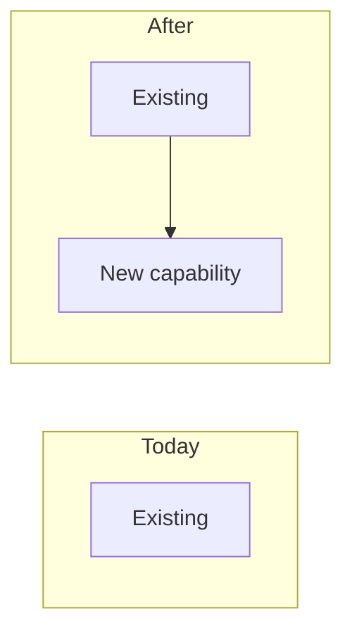

## Why

<!-- Explain the motivation for this change. What problem does this solve? Why now? -->

## What Changes

<!-- Describe what will change. Be specific about new capabilities, modifications, or removals. -->

## At a Glance

<!-- One diagram that makes the change legible before anyone reads the prose:
     what exists today vs what this change adds, or where it lands in the system.
     Replace the placeholder. Keep it small - this is the map, not the design
     (component internals and sequences belong in design.md). -->

## Capabilities

### New Capabilities
<!-- Capabilities being introduced. Use kebab-case for path segments you introduce
     (e.g., user-auth or identity/user-auth) that follow the project's existing
     spec organization. Each creates specs/<capability-path>/spec.md. -->
- `<capability-path>`: <brief description of what this capability covers>

### Modified Capabilities
<!-- Existing capabilities whose REQUIREMENTS are changing (not just implementation).
     Only list here if spec-level behavior changes. Each needs a delta spec file.
     Use the exact existing path under openspec/specs/. Leave empty if no requirement
     changes. A change with no capabilities at all (pure refactor, tooling, docs)
     must set `skip_specs: true` in its .openspec.yaml - openspec validate rejects
     a zero-delta change without that marker. Do not invent a requirement just to
     satisfy validation. -->
- `<existing-capability-path>`: <what requirement is changing>

## Impact

<!-- Affected code, APIs, dependencies, systems -->
